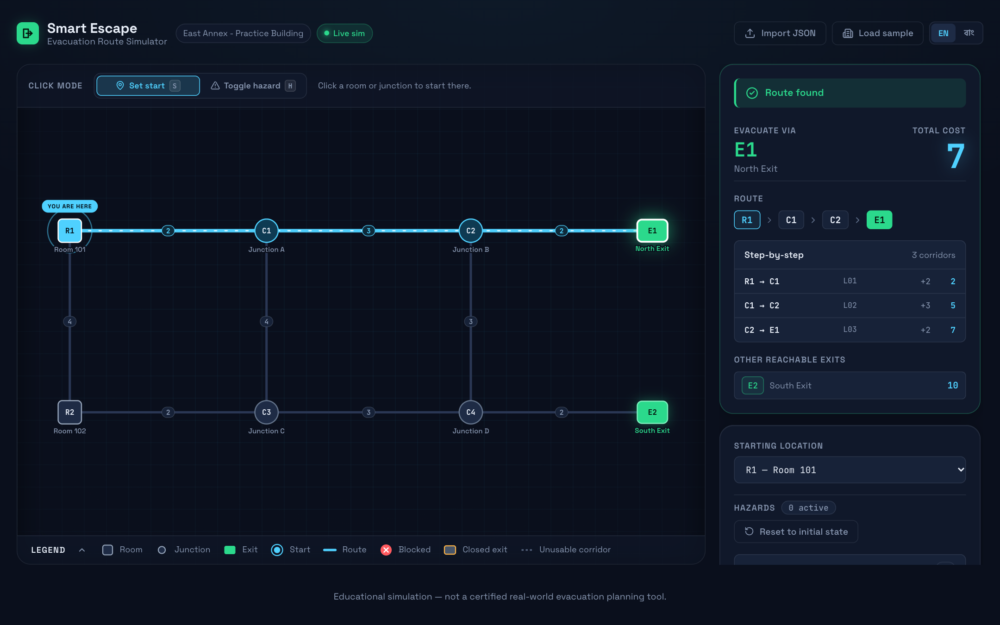
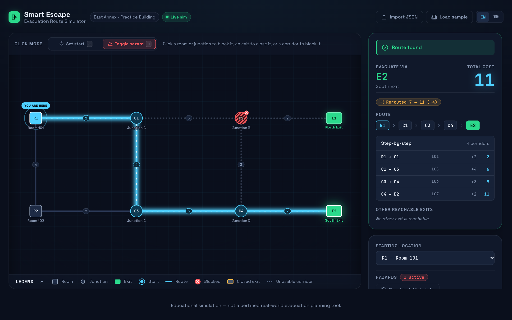

# Smart Escape — Interactive Evacuation Route Simulator

> AI DevFest 2026 · Vibe-Coding mock test · Frontend-only web app (English / বাংলা)

| | |
|---|---|
| **Name** | _<your full name>_ |
| **Registration number** | _<your registration number>_ |
| **Live site (HTTPS)** | https://ai-dev-fest-2026-vibe-coding-mock.pages.dev |
| **Repository** | https://github.com/shihabshahrier/AI-DEV-FEST-2026-VIBE-CODING-MOCK- |

Smart Escape loads a building graph (`building.json`), draws it as an interactive blueprint, and finds the
**lowest-cost route** from a chosen room or junction to an open exit. Block rooms, junctions or corridors, or close exits,
and the route is recalculated instantly — or the app clearly reports **No route available** / **Starting location blocked**.

> Educational simulation — not a certified real-world evacuation planning tool.

## Screenshots

| Baseline (start R1 → E1, cost 7) | After blocking C2 (R1 → E2, cost 11) |
|---|---|
|  |  |

Reroute moment (old route fades out in red while the new one draws in): [`screenshots/reroute-C2-blocked-transition.png`](screenshots/reroute-C2-blocked-transition.png) ·
Bangla mode: [`screenshots/bangla-mode.png`](screenshots/bangla-mode.png)

## How to run

Requires Node.js 22 (pinned in `.node-version`).

```bash
npm install
npm run dev      # local dev server
npm run build    # production build into dist/
npm test         # 25 unit + brute-force fuzz tests (vitest)
```

**Deployment:** Cloudflare Pages, connected to this repo — build command `npm run build`, output directory `dist`.
Every push to `main` deploys automatically. Static files only; no server code, no functions.

**Using the app:** click **Load sample** (or **Import JSON** / drag-and-drop any `building.json` with the same schema) →
pick a starting room/junction on the map or from the *Starting location* list → switch to **Toggle hazard** mode (or use
the switches in the sidebar) to block/unblock rooms, junctions and corridors and close/reopen exits.
Keyboard: `S` set-start mode · `H` hazard mode · `R` reset to `initial_state`.

## Main features (mandatory tasks)

- **Import and map** — validates the file and lists every problem clearly (bilingual); draws all nodes at the supplied
  coordinates (normalized to the canvas, aspect ratio kept), readable labels, distinct shapes per type
  (room = square, junction = circle, exit = green exit sign) and a cost label on every corridor.
- **Select and calculate** — choose an unblocked room or junction; the lowest-cost route is highlighted with its node
  sequence, exit and total cost.
- **Change conditions** — block/unblock rooms, junctions and corridors; close/reopen exits. Each state is visually
  distinct (hazard stripes + ✕ badge, red dashed corridor, grey exit with lock, dimmed unusable corridors).
- **Update and reset** — the route is a pure function of *(graph, hazards, start)* and is recomputed on every change;
  **Reset** restores the file's original `initial_state`.
- **Failure cases** — shows **No route available** and **Starting location blocked** (and their Bangla equivalents).
- **Two languages** — English / বাংলা toggle for all labels, buttons, statuses, errors and instructions (Bangla digits in
  Bangla mode); dataset labels stay as supplied. The choice is remembered.
- **Animations** — start halo + "You are here" pin, hazard pop, route draw-in with flowing dashes; all brief, no flashing,
  and disabled under `prefers-reduced-motion`.

### Routing rules (src/lib/route.js)

Dijkstra over usable corridors only (blocked nodes and their corridors, blocked corridors and closed exits are removed).
Cost is the sum of corridor costs. Ties: smallest total cost → lexicographically smallest exit ID → lexicographically
smallest node-ID sequence (plain code-unit order, case-sensitive). Each node keeps the best `(cost, path)` pair, where
an equal-cost path replaces the stored one only if its node sequence is smaller. Note: in the sample, blocking C2 creates
a cost-11 tie between `R1-C1-C3-C4-E2` and `R1-R2-C3-C4-E2`; the tie-break correctly picks the first.

Verified by 24 rule tests (the five sample checks, ties, case sensitivity, disconnected graphs, invalid input) and a fuzz
test comparing the router with brute-force enumeration of all simple paths on 1,500 random graphs with random hazards.

## Bonus features

- **Alternative routes** — the other reachable exits with their costs.
- **Route walkthrough** — step-by-step corridor list with running totals; hovering a route chip highlights the node.
- **Reroute insight** — "Rerouted 7 → 11 (+4)" badge and the previous route fading out in red on the map.
- **Hover tooltips** — node type, state and cost from the current start.
- **Saving progress** — the loaded file, hazards and start are restored from `localStorage` after a reload.
- **Accessible controls** — every map action is also available from keyboard-focusable sidebar switches; keyboard
  shortcuts; focus rings; shape + colour encoding (not colour alone); reduced-motion support.

## Known problems

- No zoom/pan: very dense maps (nodes almost on top of each other) can have overlapping labels, although markers shrink
  automatically on crowded maps.
- PNG export is not implemented.
- If the browser blocks `localStorage` (some private modes), progress is simply not saved.

## AI tools used

- **Claude Code (Claude Opus 5.5)** — planning, rule analysis, validation, routing, tests, SVG map, app state,
  reviewing and integrating all generated code, Git commits.
- **Antigravity CLI (Gemini 3.8 Flash High)** — drafted the panel components and the main stylesheet from a written
  design brief; the drafts were reviewed and fixed before committing.

## Most useful prompt

> "so we are doing this mock test to prepare for this. understand everything properly and make me understand the problem
> first meanwhile make the whole plan to solve this problem. plan the ui/ux and all the logics behind it. we gonna deploy
> it to cf page and it will automatically picked up by cf pages. we gonna use react. … understand all the rules first and
> keep all of them on mind. lets solve this."

It produced the full rule checklist and the routing plan, including spotting the hidden cost-11 tie in the C2 sample check
before any code was written.

## License

[MIT](LICENSE)
